# CodeSquad masters test 
## Step 3: 루빅스 큐브 구현하기
### 루빅스 큐브
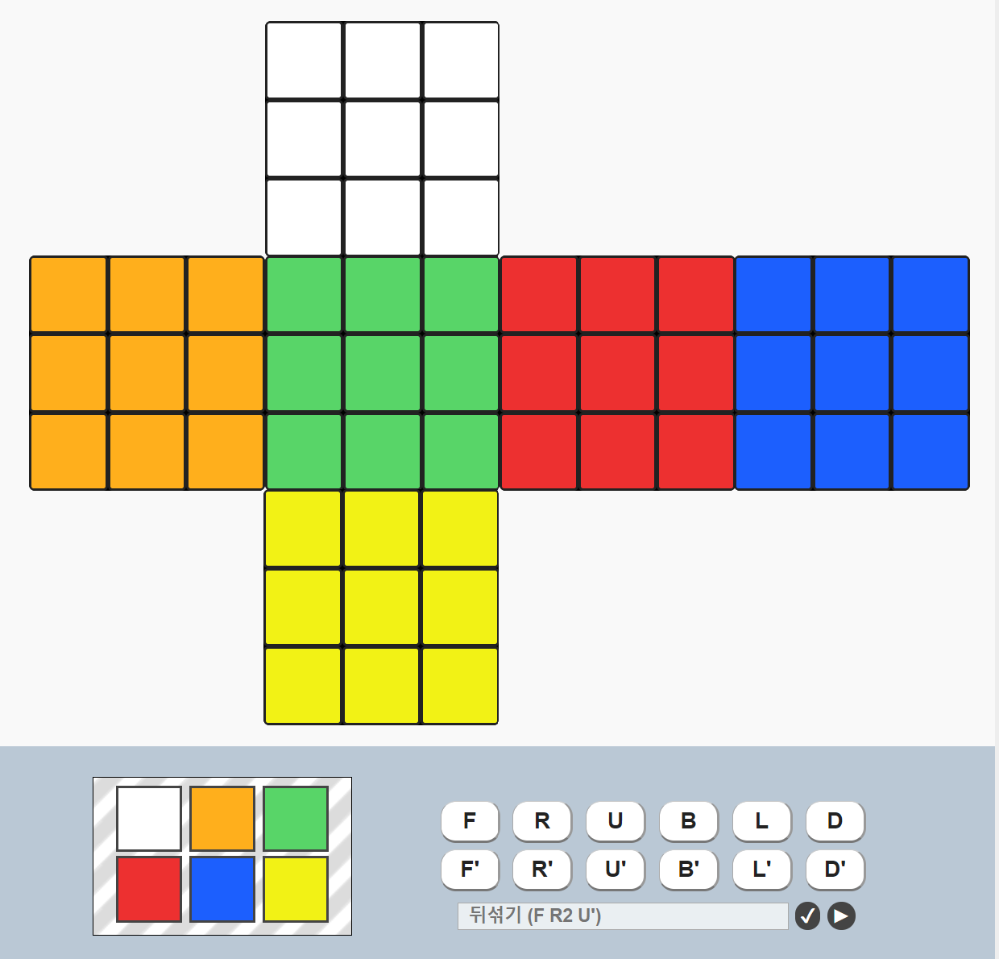  
참고 사이트 :  https://rubiks-cube-solver.com/ko/
### 규칙
- [x] 큐브는 W, B, G, Y, O, R의 6가지 색깔을 가지고 있다.
- [x] 입력: 각 조작법을 한 줄로 입력받는다.
- [x] 출력: 큐브의 6면을 펼친 상태로 출력한다.
- [x] Q를 입력받으면 프로그램을 종료하고, 조작 받은 명령의 갯수를 출력시킨다.

### 큐브의 초기 상태
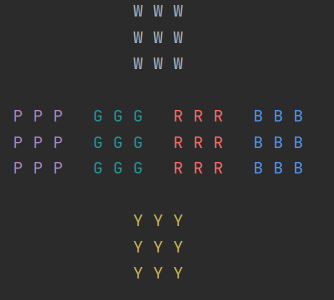  

큐브는 6면으로 구성되어 있으며 각 면은 모두 다른 색깔을 가진다.
                    
### 동작
##### 1. 윗면 기준
|U (시계방향으로 회전)|U' (반시계방향으로 회전)|
|---|---|
|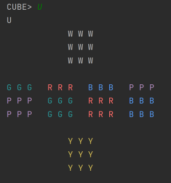 |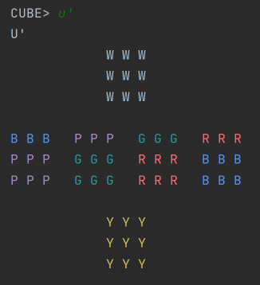|

- 큐브의 윗 면을 잡고 시계방향 또는 반시계방향으로 돌리는 동작이다.
- "u" 또는 "U"를 입력하면 큐브의 윗면이 시계방향으로 돌아간다. 
오른쪽,앞쪽,왼쪽,뒷쪽면의 줄은 **왼쪽**으로 미뤄진다.   

- "u'" 또는 "U'"를 입력하면 큐브의 윗면이 반시계방향으로 돌아간다. 
오른쪽,앞쪽,왼쪽,뒷쪽면의 줄은 **오른쪽**으로 미뤄진다.  

##### 2. 뒷면 기준
|D (시계방향으로 회전)|D' (반시계방향으로 회전)|
|---|---|
|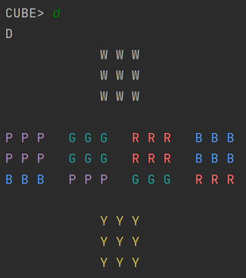 |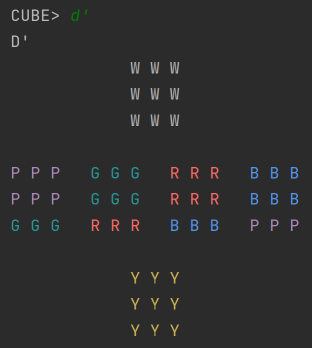|

- 큐브의 아랫면을 잡고 시계방향 또는 반시계방향으로 돌리는 동작이다.
- "d" 또는 "D"를 입력하면 큐브의 아랫면이 시계방향으로 돌아간다. 
오른쪽,앞쪽,왼쪽,뒷쪽면의 줄은 **오른쪽**으로 미뤄진다.   

- "d'" 또는 "D'"를 입력하면 큐브의 아랫면이 반시계방향으로 돌아간다. 
오른쪽,앞쪽,왼쪽,뒷쪽면의 줄은 **왼쪽**으로 미뤄진다. 

##### 3. 오른쪽면 기준
|R (시계방향으로 회전)|R' (반시계방향으로 회전)|
|---|---|
|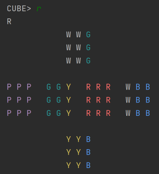 |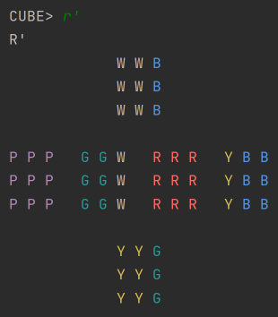|

- 큐브의 오른쪽면을 잡고 시계방향 또는 반시계방향으로 돌리는 동작이다.
- "r" 또는 "R'"를 입력하면 큐브의 오른쪽면이 시계방향으로 돌아간다. 
윗쪽,앞쪽,아랫쪽,뒷쪽면의 줄은 **위쪽**으로 미뤄진다.   

- "r'" 또는 "R'"를 입력하면 큐브의 오른쪽면이 반시계방향으로 돌아간다. 
윗쪽,앞쪽,아랫쪽,뒷쪽면의 줄은 **아래쪽**으로 미뤄진다. 

##### 4. 왼쪽면 기준
|L (시계방향으로 회전)|L' (반시계방향으로 회전)|
|---|---|
|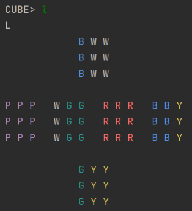 |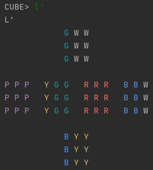|

- 큐브의 왼쪽면을 잡고 시계방향 또는 반시계방향으로 돌리는 동작이다.
- "l" 또는 "L'"를 입력하면 큐브의 왼쪽면이 시계방향으로 돌아간다. 
오른쪽,앞쪽,왼쪽,뒷쪽면의 줄은 **아래쪽**으로 미뤄진다.   

- "l'" 또는 "L'"를 입력하면 큐브의 왼쪽면이 반시계방향으로 돌아간다. 
오른쪽,앞쪽,왼쪽,뒷쪽면의 줄은 **윗쪽**으로 미뤄진다. 

##### 5. 앞면 기준
|F (시계방향으로 회전)|F' (반시계방향으로 회전)|
|---|---|
|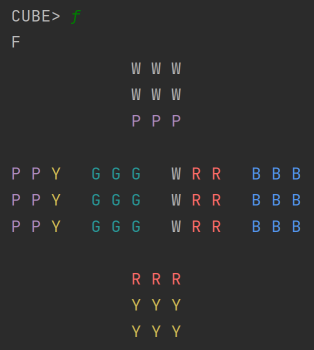 |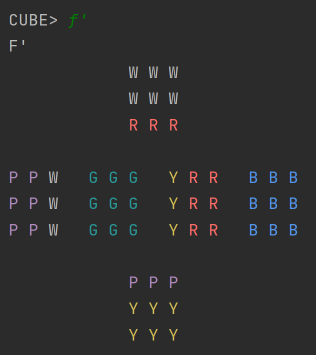|

- 큐브의 앞면을 잡고 시계방향 또는 반시계방향으로 돌리는 동작이다.
- "f" 또는 "F'"를 입력하면 큐브의 앞면이 시계방향으로 돌아간다. 
오른쪽,윗쪽,왼쪽,아래쪽 면의 줄은 **시계방향**으로 미뤄진다.   

- "f'" 또는 "F'"를 입력하면 큐브의 앞면이 반시계방향으로 돌아간다. 
오른쪽,윗쪽,왼쪽,아래쪽 면의 줄은 **반시계방향**으로 미뤄진다.

##### 6. 아랫면 기준
|B (시계방향으로 회전)|B' (반시계방향으로 회전)|
|---|---|
|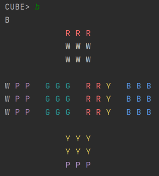 |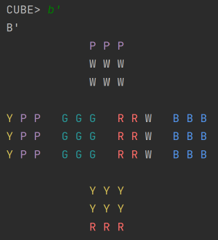|

- 큐브의 아랫면을 잡고 시계방향 또는 반시계방향으로 돌리는 동작이다.
- "b" 또는 "B'"를 입력하면 큐브의 아랫면이 시계방향으로 돌아간다. 
오른쪽,윗쪽,왼쪽,아래쪽 면의 줄은 **반시계방향**으로 미뤄진다.   

- "b'" 또는 "B'"를 입력하면 큐브의 아랫면이 반시계방향으로 돌아간다. 
오른쪽,윗쪽,왼쪽,아래쪽 면의 줄은 **시계방향**으로 미뤄진다.

##### 7. 여러줄 입력받기
|여러줄 입력받기|이상한 값 포함하여 입력받기|
|---|---|
|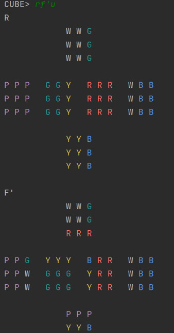|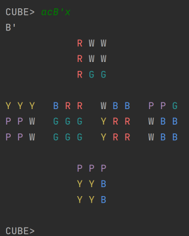

- 여러줄을 한 번에 입력받을 수 있다. 만약, 입력값으로 f,r,u,d,b,l,f',r',u',d',b',l' 이외의 값이 들어오면 무시하며 큐브는 동작하지 않는다.

##### 8. 큐브 무작위로 섞기
|S|
|---|
|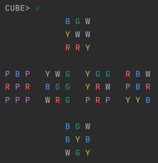 |

- "s" 또는 "S" 명령어를 입력하면 큐브가 랜덤으로 섞인다.

##### 9. 끝내기
|Q 명렁어로 끝내기|큐브를 다 맞추고 끝내기|
|---|---|
|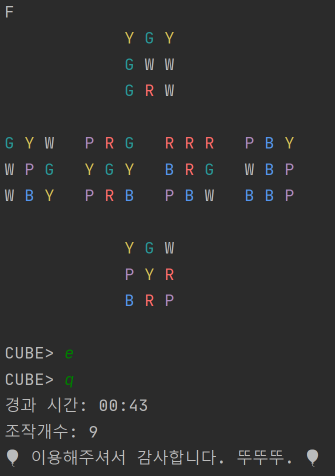 |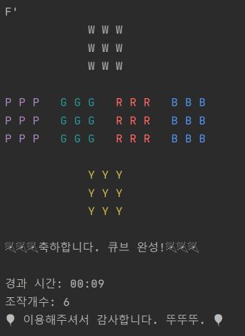|

- "q" 또는 "Q"를 입력하면 프로그램을 종료하고, 경과 시관과 조작개수를 출력한다.
조작 개수는 Command에 해당하는 값을 통해 큐브가 움직인 수만 세며, 그 이외의 값들을 입력하였을 경우에는 큐브가 움직이지 않으므로 개수를 세지 않는다.
- Q 명령어를 입력하지 않아도 큐브를 다 완성시켰을 경우에는 축하 메세지를 띄우며 프로그램을 종료한다.

### 구현
##### 1. 클래스
    1) Application: 큐브 프로그램 동작하는 클래스(Main)
    2) Block: 큐브의 각 블록
    3) RubiksCube: 루빅스 큐브
    4) Pusher: 큐브의 각 면의 지정한 라인을 옆의 면으로 미는 기능
    5) Rotator: 루빅스 큐브를 회전 시킴
    6) Printer: 루빅스 큐브를 출력
    7) Shuffler: 루빅스 큐브를 무작위로 섞음
    8) Terminator: 루빅스 큐브가 다 맞추어 졌을 경우 종료시킴
    9) BlockColor: 큐브 블록의 색깔들
    10) Command: 큐브를 작동시키는 명령어들
    11) Direction: 회전 방향(Right, Left)

##### 2. 주요 클래스 기능
**1) Pusher.java**  
- **pushBlock(int num, Direction direction)**: Block[] 배열을 저장하는 deque에서 num만큼 지정한 방향으로 밀어낸다. 
- ex) pushBlock(2,LEFT):
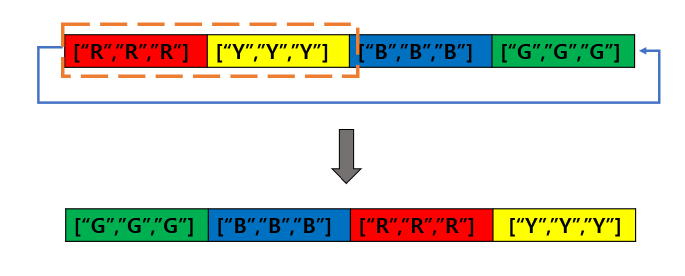  
      
**2) Rotator.java**
- 각 Command(U,D,R,L,F,B)에 해당하는 옆 면을 회전하는 동작을 구현. ( U 를 입력할 경우, 기준이 되는 윗면의 옆 면들(오른쪽,앞쪽,왼쪽,뒷쪽)을 회전)
- ex)turnFrontSide(LEFT,topSide,rightSide,bottomSide,leftSide) : F'에 해당하는 동작
- 해당하는 면을 순서에 맞추어 적어주어야 한다. 방향이 LEFT일 경우, 기준면을 왼쪽으로 돌린다는 뜻이다. 
- 각 면의 해당 라인을 가져온다.(ex)getBottomLine(side1)  
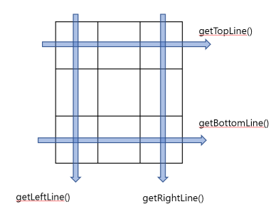  
- 해당라인이 옆 면으로 밀어질 때 순서가 바뀌어 넘어가는 경우에 reverse()로 감싸준다.
- pusher.insertBlock > pusher.pushBlock > setLine 순서로 진행.

        //cmd: F
        //direction,topside,rightside,bottomside,leftside
        public void turnFrontSide(Direction direction, Block[][] side1, Block[][] side2, Block[][] side3, Block[][] side4) {
            switch (direction){
                case RIGHT:
                    pusher.insertBlock(getBottomLine(side1),reverse(getLeftLine(side2)),
                            getTopLine(side3),reverse(getRightLine(side4)));
                    break;
                case LEFT:
                    pusher.insertBlock(reverse(getBottomLine(side1)),getLeftLine(side2),
                            reverse(getTopLine(side3)),getRightLine(side4));
                    break;
            }
    
            pusher.pushBlock(1,direction);
    
            setBottomLine(pusher.getBlocks(),side1);
            setLeftLine(pusher.getBlocks(),side2);
            setTopLine(pusher.getBlocks(),side3);
            setRightLine(pusher.getBlocks(),side4);
    
        }
        

**3) RubiksCube.java**  
- 루빅스 큐브 각 면에 이름을 붙여준다.  
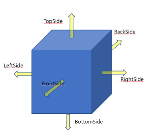  

- 각 면을 원하는 색깔로 채운다.

    //한 면을 같은 색의 블록으로 채우기
    private void fillColor(Block[][] side,String color){
        for(Block[] line: side){
            Arrays.fill(line,new Block(color));
        }
    }
    

- Command에 맞는 회전 동작을 실행.
- ex)"U"를 입력하였을 경우:

 1)기준이 되는 윗면을 시계방향으로 돌린다.(turnBaseSide)   
 
 |기준 면 회전 전|기준 면 회전 후|
 |--------------|---------------|
 |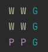|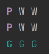|
 
 2)옆 면들을 반시계방향으로 돌린다.(turnTopSide)

    public void rubiksCubeProcess(Command command) {
        switch (command){
            case UP:
                rotator.turnBaseSide(Direction.RIGHT,topSide);
                rotator.turnTopSide(Direction.LEFT,leftSide,frontSide,rightSide,backSide);
                break;
                
 

